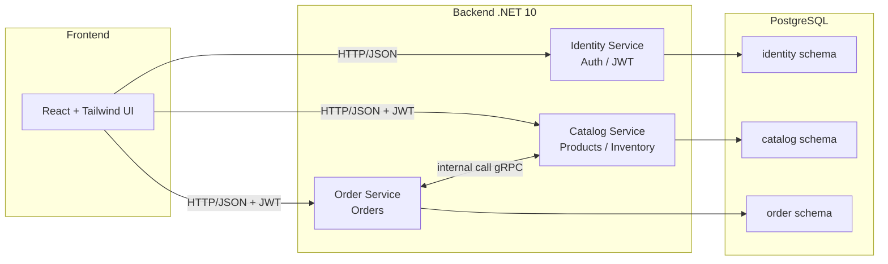
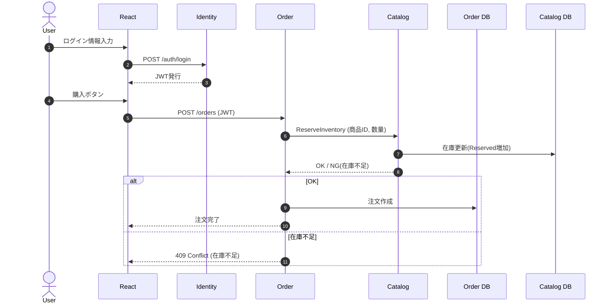
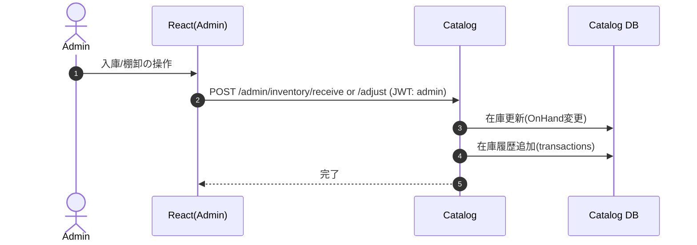

# 第1章 要件定義とアーキテクチャ固定

「在庫管理」を題材に、実務でよくある構成（React + .NET 10 + PostgreSQL）で、ユーザーと管理者が使えるシステムを一通り構築します。

最初にやるべきことは 1つだけです。

> 要件（何を作るか）と、アーキテクチャ（どう分けるか）を最初に固定すること

ここがブレると、途中で「画面はあるけどAPIがない」「在庫の整合性が崩れる」など、開発も記事も破綻します。

## 1-1. 登場人物（ロール）と目的

このシステムには2種類の利用者がいます。

- ユーザー：商品を探して購入する（注文する）
- 管理者：商品と在庫を管理し、注文を処理する

「ECサイト + 在庫管理 + 注文管理」の最小セットだと思ってください。

## 1-2. 機能要件（何ができる必要があるか）

### ユーザー向け機能（購入側）

- ログイン / ログアウト
- 商品一覧閲覧
- 商品詳細閲覧
- カートに追加 / 削除
- 購入（注文作成）
- 注文履歴の確認

### 管理者向け機能（運用側）

- ログイン / ログアウト
- 商品登録 / 編集 / 非公開（販売停止）
- 在庫の操作
  - 入庫（仕入れ）
  - 出庫（返品/破損など）
  - 棚卸（在庫数の調整）
- 注文処理
- ステータス更新（受付→出荷→完了 / キャンセル）
- 注文の一覧・検索

## 1-3. ドメイン要件

在庫管理は “数字が合っていること” が価値なので、ここを曖昧にしません。

### 在庫の基本概念

- `OnHand`（手持ち在庫）：倉庫に実在する在庫数
- `Reserved`（引当在庫）：注文により確保された在庫数
- `Available`（販売可能）：`OnHand` - `Reserved`

### 必須ルール

- 注文確定時に 在庫を引当 する（`Reserved`が増える）
- 引当できない（`Available`不足）場合は 注文不可
- 管理者の棚卸で `OnHand` を変更した場合も、整合性が崩れないようにする
- 在庫は競合が起きやすいので、更新時に 同時更新対策 が必要

## 1-4. 非機能要件

最低限これを入れます。

- 認証：JWT（Access Token）
- 認可：Roleベース（User / Admin）
- 監査ログ：在庫変動、注文ステータス変更は履歴が残る
- 競合対策：在庫更新は楽観ロック（Version）またはトランザクションで守る
- 例外設計：在庫不足は “想定内エラー” として扱う

## 1-5. システム分割

最初から細かく割りすぎず 3サービス に切ります。

- `Identity Service`：ログイン、トークン発行、ユーザー管理
- `Catalog Service`：商品・在庫の管理（在庫の整合性の中心）
- `Order Service`：注文作成・注文状態管理

フロントは `React` で共通、`DB`は `PostgreSQL` を使います。

## 1-6. アーキテクチャ図

### (1) 全体構成図（フロント → API群 → DB）

- フロントは JWTを付けて `Catalog` / `Order` を呼ぶ
- 注文時、`Order` は `Catalog` に「在庫引当」を依頼する（ここが整合性の中心）

### (2) 主要ユースケース図（購入フロー）

### (3) 管理者の在庫操作フロー（入庫・棚卸）

## 1-7. まとめ

この章では以下を固定しました。

- 誰が使うか（ユーザー / 管理者）
- 何ができるか（購入、在庫管理、注文管理）
- 在庫で守るべき整合性（`OnHand / Reserved / Available`）
- サービス分割（`Identity / Catalog / Order`）
- 全体の流れ（購入時に在庫引当が発生する）

次章からは、このアーキテクチャを前提に

- リポジトリ構成
- `Docker Compose`（`Postgres + API`）
- `Identity Service`（JWTログイン）

を作っていきます。

## 対応PR

- 未作成（この章単体のPRなし）
