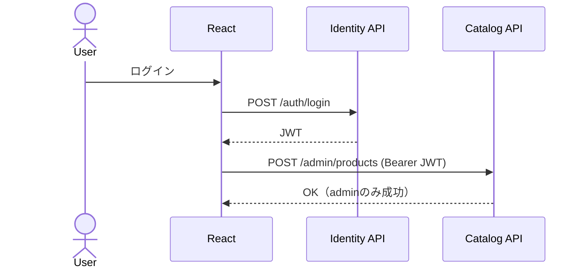

# 第3章 認証という境界を作る（JWT / Role / テスト運用）

第2章で開発環境が整いました。

- Docker Compose で全サービス起動
- `/health` で疎通確認

第3章では、システムに認証という境界を作ります。

## 3-1. この章のゴール

- ログインAPIを作る
- JWTを発行する
- 他サービスでJWTを検証する
- ロール（user / admin）でAPIを制御する

## 3-2. Identity Service の責務

`Identity Service` は以下だけを担当します。

- ログイン
- JWT発行
- ロール付与

他サービス（Catalog / Order）は

- トークンを検証するだけ

にします。

責務を分離することで、認証ロジックが散らばるのを防ぎます。

## 3-3. JWT設定（Identity.Api）

`Program.cs` に JWT 認証・認可を追加します。

```csharp:Program.cs
using Microsoft.AspNetCore.Authentication.JwtBearer;
using Microsoft.IdentityModel.Tokens;
using System.Text;

var builder = WebApplication.CreateBuilder(args);

builder.Services.AddControllers();
builder.Services.AddEndpointsApiExplorer();
builder.Services.AddSwaggerGen();

// ===== JWT: 署名キー =====
var key = "super_secret_development_key_12345";
var signingKey = new SymmetricSecurityKey(Encoding.UTF8.GetBytes(key));

// ===== JWT: 認証（Bearer）を追加 =====
builder.Services.AddAuthentication(JwtBearerDefaults.AuthenticationScheme)
   .AddJwtBearer(options =>
   {
       options.TokenValidationParameters = new TokenValidationParameters
       {
           ValidateIssuer = false,
           ValidateAudience = false,
           ValidateIssuerSigningKey = true,
           IssuerSigningKey = signingKey,
           ValidateLifetime = true
       };
   });

// ===== 認可（[Authorize] を使えるように） =====
builder.Services.AddAuthorization();

var app = builder.Build();

app.UseSwagger();
app.UseSwaggerUI();

// ===== 認証/認可ミドルウェアをパイプラインに追加 =====
app.UseAuthentication();
app.UseAuthorization();

app.MapControllers();

app.Run();

public static class JwtSettings
{
   public const string SecretKey = "super_secret_development_key_12345";
}
```

## 3-4. AuthController を作成

`/auth/login` を作成し、正しい認証情報なら JWT を返します。

```csharp:Controllers/AuthController.cs
using Microsoft.AspNetCore.Mvc;
using Microsoft.IdentityModel.Tokens;
using System.IdentityModel.Tokens.Jwt;
using System.Security.Claims;
using System.Text;

namespace Identity.Api.Controllers;

[ApiController]
[Route("auth")]
public class AuthController : ControllerBase
{
    [HttpPost("login")]
    public ActionResult<LoginResponse> Login([FromBody] LoginRequest request)
    {
        if (request.Email == "admin@test.com" && request.Password == "password")
        {
            var token = GenerateToken("1", "admin");
            return Ok(new LoginResponse(token));
        }

        if (request.Email == "user@test.com" && request.Password == "password")
        {
            var token = GenerateToken("2", "user");
            return Ok(new LoginResponse(token));
        }

        return Unauthorized();
    }
}

public record LoginRequest(string Email, string Password);
public record LoginResponse(string Token);
```

## 3-5. JWTを他サービスで検証する

`Catalog` / `Order` の `Program.cs` に同じ `SecretKey` を設定します。

```csharp:Program.cs
builder.Services.AddAuthentication(JwtBearerDefaults.AuthenticationScheme)
    .AddJwtBearer(options =>
    {
        options.TokenValidationParameters = new TokenValidationParameters
        {
            ValidateIssuer = false,
            ValidateAudience = false,
            ValidateIssuerSigningKey = true,
            IssuerSigningKey = new SymmetricSecurityKey(
                Encoding.UTF8.GetBytes(JwtSettings.SecretKey)
            ),
            ValidateLifetime = true
        };
    });

builder.Services.AddAuthorization();
app.UseAuthentication();
app.UseAuthorization();
```

## 3-6. 管理者専用APIを作る

`Catalog` に管理者専用エンドポイントを作成します。

```csharp:Catalog/Controller/AdminProductsController.cs
using Microsoft.AspNetCore.Authorization;
using Microsoft.AspNetCore.Mvc;

[ApiController]
[Route("admin/products")]
public class AdminProductsController : ControllerBase
{
    [HttpPost]
    [Authorize(Roles = "admin")]
    public IActionResult CreateProduct()
    {
        return Ok("Product created");
    }
}
```

adminロールを持つJWTでのみアクセス可能になります。

## 3-7. xUnitで動作確認

本章では統合テストで以下を確認しています。

- `Identity.Api.Tests`
- `admin@test.com / password` でログイン成功（200 + JWT）
- 不正な資格情報で 401
- `Catalog.Api.Tests`
- トークンなしで `POST /admin/products` は 401
- `user` ロールで 403
- `admin` ロールで 200

テスト内容:

https://github.com/Kaito-Nishihara/inventory-management/commit/0a5a7340586f9bc3df742539e0eac410e03de0d4

## 3-8. Docker Compose でのベストなテスト運用

`docker compose up` 起動時にテストを自動実行するのは避け、  
**テスト専用 profile を分離**するのが実運用では扱いやすいです。

`compose.yml` に `test-runner` を追加します。

```yaml:compose.yml
services:
  test-runner:
    image: mcr.microsoft.com/dotnet/sdk:10.0
    container_name: inv-test-runner
    working_dir: /workspace
    profiles:
      - test
    volumes:
      - ./:/workspace
    command: ["dotnet", "test", "inventory-management.sln"]
```

実行方法:

```bash
# 通常起動（テストは走らない）
docker compose up -d

# 必要なときだけテスト実行
docker compose --profile test run --rm test-runner

# 結果
# Test summary: total: 5, failed: 0, succeeded: 5, skipped: 0, duration: 1.8s
```

これで問題なく認証ができていることを確認できました。

## 3-9. アーキテクチャ図



## 対応PR

- 未作成（この章単体のPRなし）
