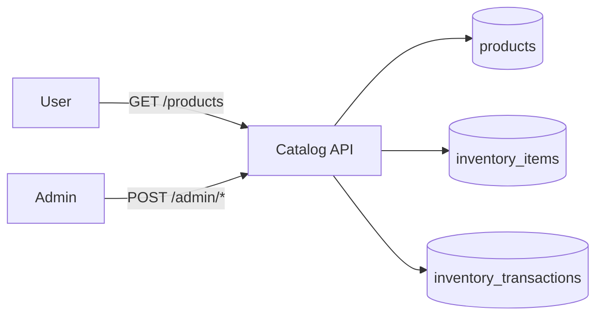
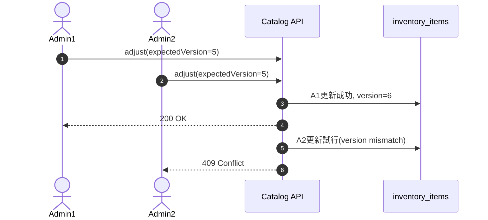

# 第6章 Catalog機能APIを実装する（商品 / 在庫 / 競合対策）

第1章で定義した要件のうち、今回は `Catalog Service` の中核を実装します。  
この章は「商品を見せる」だけでなく、在庫の整合性を壊さないことが主目的です。

## 6-1. この章のゴール

- ユーザー向け商品APIを実装する
- 管理者向け商品管理APIを実装する
- 在庫操作API（入庫/出庫/棚卸）を実装する
- 在庫更新の競合を検知し、`409 Conflict` で返す

## 6-2. まず押さえる在庫の考え方（初心者向け）

在庫で扱う数字は3つです。

- `OnHand`：倉庫に実在する在庫
- `Reserved`：注文のために取り置きした在庫
- `Available`：販売できる在庫（`OnHand - Reserved`）

`Available` がマイナスになると業務破綻なので、  
更新時に必ずルールで守ります。

## 6-3. 全体フロー（Mermaid）



ポイント:

- ユーザーは公開商品を見るだけ
- 在庫を動かせるのは管理者APIのみ
- 在庫変更は `inventory_transactions` に履歴を残す

## 6-4. 実装したAPI

### ユーザー向け

- `GET /products`（公開商品の一覧）
- `GET /products/{id}`（公開商品の詳細）

### 管理者向け（adminロール）

- `POST /admin/products`
- `PUT /admin/products/{id}`
- `POST /admin/products/{id}/publish`
- `POST /admin/inventory/receive`
- `POST /admin/inventory/issue`
- `POST /admin/inventory/adjust`

## 6-5. ドメインモデル

```csharp:services/catalog/Catalog.Api/Domain/Product.cs
public class Product
{
    public Guid Id { get; private set; }
    public string Name { get; private set; } = string.Empty;
    public decimal Price { get; private set; }
    public bool IsPublished { get; private set; }
}
```

```csharp:services/catalog/Catalog.Api/Domain/InventoryItem.cs
public class InventoryItem
{
    public Guid ProductId { get; private set; }
    public int OnHand { get; private set; }
    public int Reserved { get; private set; }
    public int Version { get; private set; }
    public int Available => OnHand - Reserved;
}
```

```csharp:services/catalog/Catalog.Api/Domain/InventoryTransaction.cs
public class InventoryTransaction
{
    public Guid ProductId { get; private set; }
    public string Type { get; private set; } = string.Empty; // receive / issue / adjust
    public int QuantityDelta { get; private set; }
    public int OnHandAfter { get; private set; }
}
```

## 6-6. なぜ Repository を挟むのか

`Controller/Service` から `DbContext` を直接呼ぶと、クエリや更新ロジックが散らばります。  
本章では `Repository` を使って、データアクセスの責務を集約しています。

メリット:

- どこで何を読んでいるか追いやすい
- テスト差し替えがしやすい
- Application層は「業務ルール」に集中できる

## 6-7. 競合対策（Version）を図で理解する

在庫更新系APIに `ExpectedVersion` を持たせます。

- サーバーの `InventoryItem.Version` と一致しない場合は `409 Conflict`
- 成功時に `Version` をインクリメント



これにより、古い画面状態からの更新を安全に拒否できます。

## 6-8. Applicationサービス

`ProductService`:

- 商品作成時に `InventoryItem` も同時作成
- 公開商品のみをユーザー向けAPIで返却

`InventoryService`:

- `receive` は在庫加算
- `issue` は `Available` 不足時に失敗
- `adjust` は `OnHand < Reserved` を拒否
- 更新ごとに `InventoryTransaction` を記録

## 6-9. Program.cs とDB

`CatalogDbContext` を追加し、`catalog` スキーマで以下を管理します。

- `products`
- `inventory_items`
- `inventory_transactions`

テスト時は InMemory、本番/ローカルは PostgreSQL を使用します。

```csharp:services/catalog/Catalog.Api/Program.cs
var useInMemoryCatalogDb = builder.Configuration.GetValue<bool>("CatalogDb:UseInMemory");
if (useInMemoryCatalogDb)
{
    builder.Services.AddDbContext<CatalogDbContext>(options =>
        options.UseInMemoryDatabase("catalog-tests"));
}
else
{
    builder.Services.AddDbContext<CatalogDbContext>(options =>
        options.UseNpgsql(builder.Configuration.GetConnectionString("CatalogDb")));
}
```

## 6-10. 失敗時の見え方（初心者向け）

管理者の在庫APIでよく返るステータス:

- `400 BadRequest`：入力値が不正（数量0以下など）
- `404 NotFound`：対象商品が存在しない
- `409 Conflict`：在庫不足 or 競合（Version不一致）

`409` は「サーバーが落ちた」ではなく、  
業務上起きうる想定内エラーとして扱います。

## 6-11. xUnit統合テスト

以下をテストで確認しています。

- 未認証で管理者APIは `401`
- userロールで管理者APIは `403`
- 公開商品だけが `/products` に出る
- 在庫不足で `issue` が `409`
- stale version で在庫更新が `409`

実行:

```bash
dotnet test services/catalog/Catalog.Api.Tests/Catalog.Api.Tests.csproj
```

## 6-12. まとめ

この章で、Catalog は「商品表示API」だけでなく、  
在庫整合性のルールを守る中核サービスとして成立しました。  
次章ではこの在庫機能を `Order Service` から呼び出し、購入フロー全体へ接続します。

## 対応PR

- https://github.com/Kaito-Nishihara/inventory-management/pull/4
