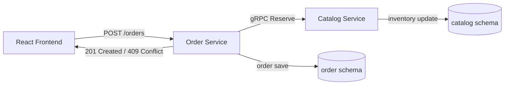
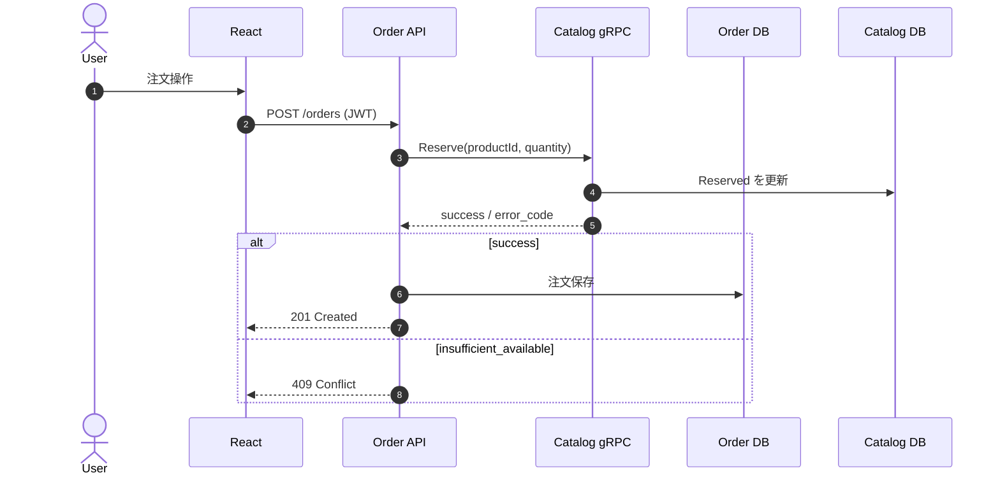
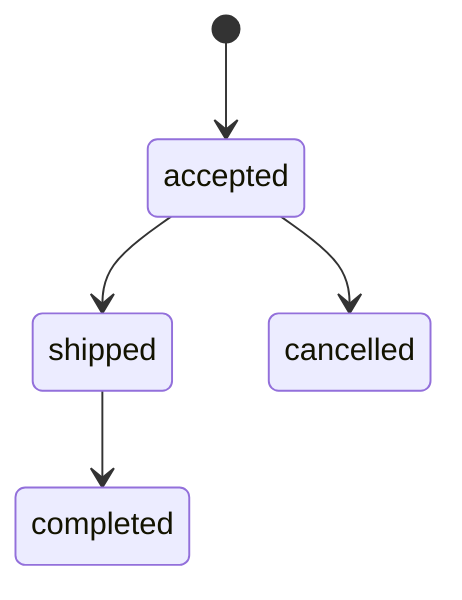

# 第7章 Order機能APIと在庫引当（gRPC連携）

第6章までで `Catalog Service` の商品/在庫管理を実装しました。  
この章では `Order Service` を実装し、`Catalog Service` への在庫引当を **gRPC** で連携します。

## 7-1. この章のゴール

- `Order Service` に注文APIを追加する
- 注文作成時に `Catalog Service` へ在庫引当を依頼する
- サービス間通信を REST ではなく gRPC にする
- 注文ステータス更新を管理者APIで制御する

## 7-2. なぜ gRPC にするのか

`Order -> Catalog` はフロント公開APIではなく、**バックエンド間の内部通信**です。  
この区間は、次の理由で gRPC が適しています。

- 契約を `.proto` で固定できる（型ズレを減らせる）
- HTTP/2 前提で小さなペイロードを高速にやり取りできる
- クライアントコードを自動生成でき、実装のブレが減る
- 将来的に双方向ストリーミング等へ拡張しやすい

REST を使うべき場面:

- 外部公開API（ブラウザや外部クライアント向け）
- デバッグ容易性や可読性（JSON直読）を優先したい場面

このプロジェクトでは役割分担として:

- `FE -> API` は REST/JSON
- `Order -> Catalog` は gRPC

に分けています。

### 補足: REST と gRPC の使い分け（初心者向け）

- REST: 人が読みやすい。ブラウザ/外部公開に向く
- gRPC: サービス間で型安全・高速。内部通信に向く

「どちらが上」ではなく、通信相手で使い分けるのが実務的です。

## 7-3. 全体フロー（Mermaid）



## 7-4. gRPC契約（proto）

`Catalog` と `Order` で同一の `inventory.proto` を持ち、契約を固定します。

```proto:services/catalog/Catalog.Api/Protos/inventory.proto
syntax = "proto3";

option csharp_namespace = "Inventory.Contracts";

package inventory;

service InventoryGrpc {
  rpc Reserve (ReserveInventoryRequest) returns (ReserveInventoryReply);
}

message ReserveInventoryRequest {
  string product_id = 1;
  int32 quantity = 2;
}

message ReserveInventoryReply {
  bool success = 1;
  string error_code = 2;
}
```

## 7-5. Catalog 側: gRPCサーバー

`Catalog` は在庫引当の実体を持つため、gRPCサーバーとして `Reserve` を提供します。

```csharp:services/catalog/Catalog.Api/Grpc/InventoryGrpcService.cs
public override async Task<ReserveInventoryReply> Reserve(ReserveInventoryRequest request, ServerCallContext context)
{
    if (!Guid.TryParse(request.ProductId, out var productId))
    {
        return new ReserveInventoryReply { Success = false, ErrorCode = "invalid_product_id" };
    }

    var result = await _inventoryService.ReserveAsync(
        new ReserveInventoryCommand(productId, request.Quantity, "order_reserve"),
        context.CancellationToken);

    return result.Status switch
    {
        InventoryUpdateStatus.Success => new ReserveInventoryReply { Success = true },
        InventoryUpdateStatus.InsufficientAvailable => new ReserveInventoryReply { Success = false, ErrorCode = "insufficient_available" },
        InventoryUpdateStatus.ConcurrencyConflict => new ReserveInventoryReply { Success = false, ErrorCode = "concurrency_conflict" },
        InventoryUpdateStatus.NotFound => new ReserveInventoryReply { Success = false, ErrorCode = "product_not_found" },
        _ => new ReserveInventoryReply { Success = false, ErrorCode = "invalid_request" }
    };
}
```

`Program.cs` では `AddGrpc()` と `MapGrpcService<InventoryGrpcService>()` を追加し、  
Kestrel を `Http1AndHttp2` で待受します。

## 7-6. Order 側: gRPCクライアント

`Order` は在庫を直接更新せず、gRPCクライアント経由で `Catalog` に依頼します。

```csharp:services/order/Order.Api/Infrastructure/Clients/CatalogInventoryGrpcGateway.cs
public async Task<ReserveResult> ReserveAsync(Guid productId, int quantity, CancellationToken cancellationToken = default)
{
    var response = await _client.ReserveAsync(new ReserveInventoryRequest
    {
        ProductId = productId.ToString(),
        Quantity = quantity
    }, cancellationToken: cancellationToken);

    return new ReserveResult(response.Success, response.ErrorCode);
}
```

### 役割分離（どこに何を書くか）

- Controller: HTTP の入口。認証/レスポンス整形
- Application(Service): ユースケース。注文作成/状態遷移
- Infrastructure: gRPC や DB など外部I/O
- Domain: `Order` と状態遷移ルール

この分割により、注文ロジックは `OrderService` に集まり、  
gRPC 実装の詳細は `CatalogInventoryGrpcGateway` に閉じ込められます。

## 7-7. 注文作成シーケンス



## 7-8. Order API

実装した主要API:

- `POST /orders`（注文作成。JWT必須）
- `GET /orders`（自分の注文一覧。adminは全件）
- `GET /orders/{id}`（注文詳細）
- `POST /admin/orders/{id}/status`（adminのみステータス更新）

注文ステータス遷移:

- `accepted -> shipped`
- `accepted -> cancelled`
- `shipped -> completed`

不正遷移は `409 Conflict` を返します。



## 7-9. エラーハンドリング方針

gRPC の `error_code` と HTTP ステータスの対応を固定します。

- `insufficient_available` -> `409 Conflict`
- `product_not_found` -> `409 Conflict`（本章では業務エラーとして扱う）
- `concurrency_conflict` -> `409 Conflict`
- `invalid_request` -> `400 BadRequest`

この対応を固定しておくと、フロントの分岐と監視ログの見通しが良くなります。

### 典型レスポンス例

- `POST /orders` 成功: `201 Created` + `orderId`
- 在庫不足: `409 Conflict` + `insufficient_available`
- ステータス不正遷移: `409 Conflict` + `invalid_transition`

`409` は業務上起きうる想定内エラーなので、  
フロントは「失敗メッセージを表示して再操作可能」にするのが基本です。

## 7-10. xUnit統合テスト

`Order.Api.Tests` で以下を確認しています。

- 在庫引当成功時に `POST /orders` が `201`
- 在庫不足時に `POST /orders` が `409`
- 管理者の正常ステータス遷移が `204`
- 不正なステータス遷移が `409`

実行:

```bash
dotnet test services/order/Order.Api.Tests/Order.Api.Tests.csproj
```

### テストで見ている境界

- 注文作成時に在庫引当失敗なら注文を作らない
- 管理者だけがステータス更新できる
- 正常遷移と異常遷移を分けて検証する

「通った/落ちた」だけでなく、  
どの境界が守られたかを読むのが実務では重要です。

## 7-11. まとめ

この章で、`Order Service` の注文APIと `Catalog Service` への在庫引当を接続できました。  
第1章アーキテクチャで定義した **Order-Catalog の内部通信（gRPC）** をここで実装しています。

## 対応PR

- 未作成（この章のPRはこれから作成）
