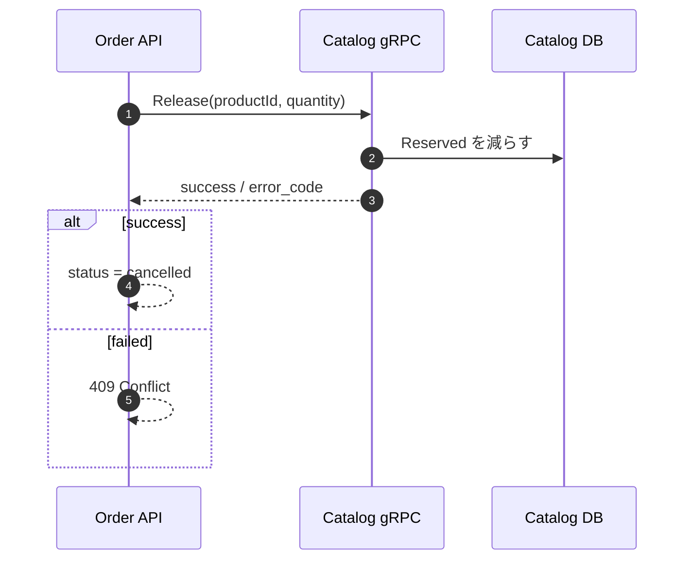

# 第8章 注文キャンセル時の在庫返却（gRPC）

第7章で「注文作成時の在庫引当」を実装しました。  
この章では **キャンセル時に引当を戻す** ことで、在庫整合性を完成させます。

## 8-1. この章のゴール

- 注文キャンセル時に `Catalog` の `Reserved` を戻す
- 返却失敗時はステータス変更を拒否する
- gRPC で返却APIを実装する
- xUnit / Compose E2E で検証する

## 8-2. なぜ必要か

注文がキャンセルされても `Reserved` が残ると、

- `Available` が減ったままになり
- 販売できる在庫が不当に減る

こうした “在庫が戻らない” 問題を防ぐのが本章の目的です。

## 8-3. gRPC契約の追加

`Reserve` に加えて `Release` を追加します。

```proto:services/catalog/Catalog.Api/Protos/inventory.proto
service InventoryGrpc {
  rpc Reserve (ReserveInventoryRequest) returns (ReserveInventoryReply);
  rpc Release (ReleaseInventoryRequest) returns (ReleaseInventoryReply);
}
```

## 8-4. Catalog側: 在庫返却

`Reserved` を減らす処理を追加します。

```csharp:services/catalog/Catalog.Api/Domain/InventoryItem.cs
public bool TryRelease(int quantity)
{
    if (quantity <= 0 || Reserved < quantity)
    {
        return false;
    }

    Reserved -= quantity;
    Version++;
    UpdatedAtUtc = DateTime.UtcNow;
    return true;
}
```

InventoryService に `ReleaseAsync` を追加し、  
gRPC から呼び出せるようにします。

## 8-5. Order側: キャンセル時の返却

`accepted -> cancelled` の時だけ `Release` を呼びます。  
返却に失敗した場合は **ステータス変更を拒否** します。

```csharp:services/order/Order.Api/Application/Orders/OrderService.cs
if (order.Status == OrderStatuses.Accepted && command.NextStatus == OrderStatuses.Cancelled)
{
    foreach (var item in order.Items)
    {
        var release = await _inventoryGateway.ReleaseAsync(item.ProductId, item.Quantity, cancellationToken);
        if (!release.Success)
        {
            return ChangeOrderStatusResult.InventoryReleaseFailed;
        }
    }
}
```

Controller では `inventory_release_failed` を `409 Conflict` として返します。

## 8-6. フロー（Mermaid）



## 8-7. テスト

### Order.Api.Tests

- 返却失敗時は `409` になる

### Compose E2E

- キャンセル後に同一商品で再注文できる

実行:

```bash
pwsh -File scripts/e2e/chapter7-compose-grpc.ps1
```

## 8-8. まとめ

この章で「引当した在庫を戻す」流れが完成しました。  
これにより、在庫の整合性が注文キャンセルまで含めて担保されます。

## 対応PR

- 未作成（この章のPRはこれから作成）
